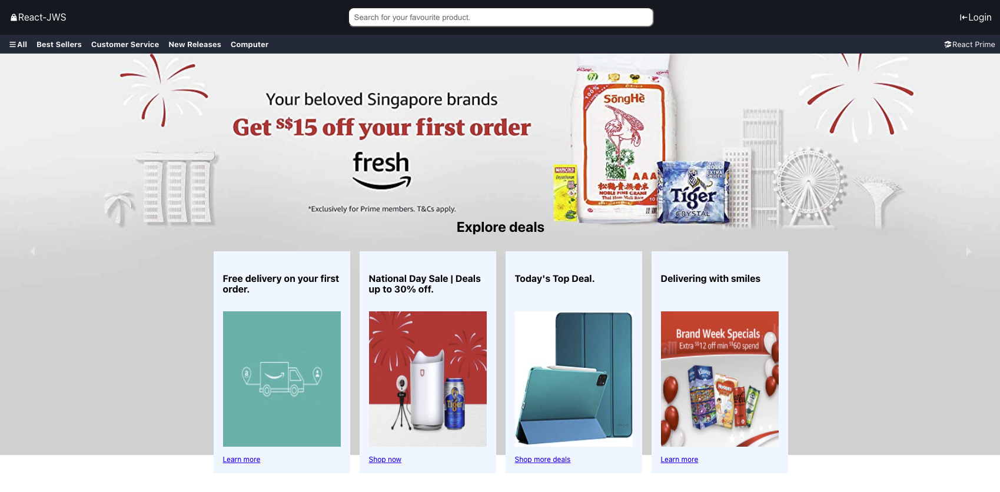
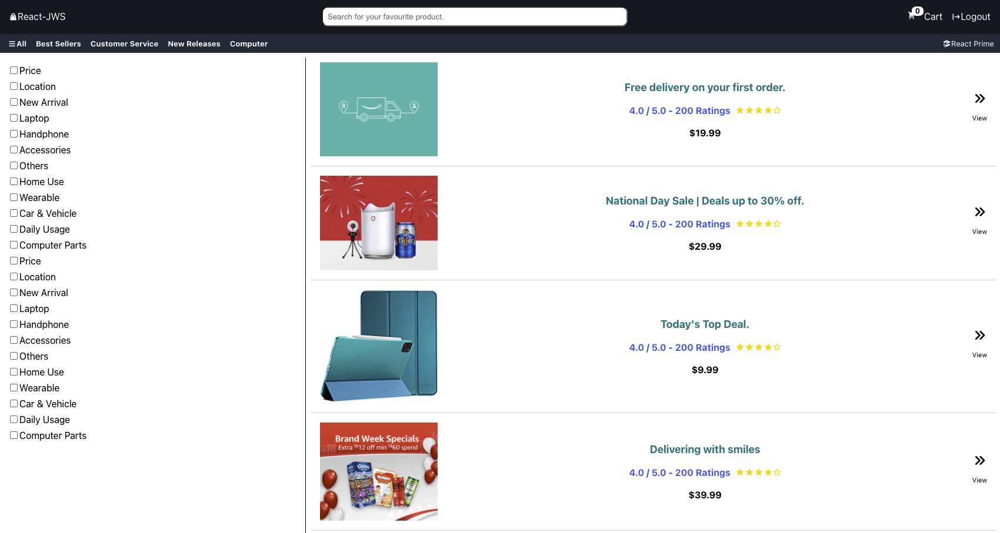
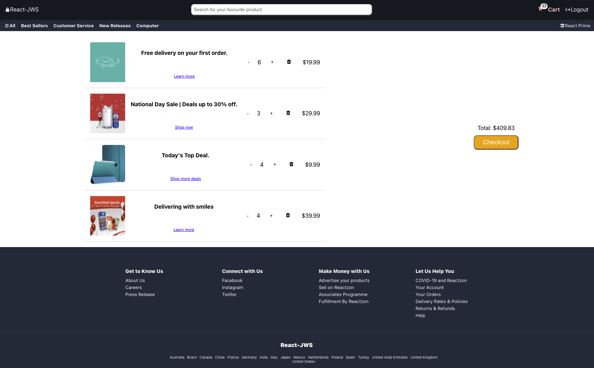

# AWS Clone using React

## Usage

This application is developed using React. To learn more about the library, [click here](https://reactjs.org/) to learn more about React.

<br />

#### To run and test this application on local machine

1. git clone from this repo.

```bash
git clone https://github.com/JoabChua/aws-clone
```

2. Install the dependencies that are required to serve this on a localhost server.

```bash
npm install
```

3. To run and start the application, run the command below.

```bash
npm run start
```

4. Head over to your browser. [click here](http://localhost:3000) to open.

<br />





<br />

## Project feature

1. Using React hooks and Redux for application state management.
2. User able to login and add item to cart and checkout.
3. Cart items and data remain in application even after application refreshes.

<br />

## Copyright

This application is fully created by JoabChua with React.
